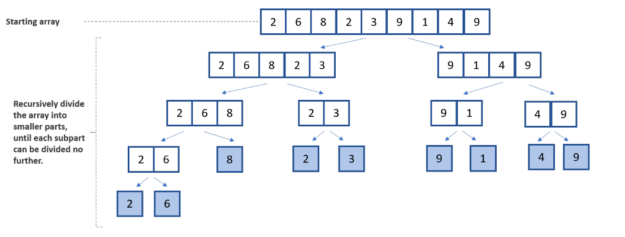
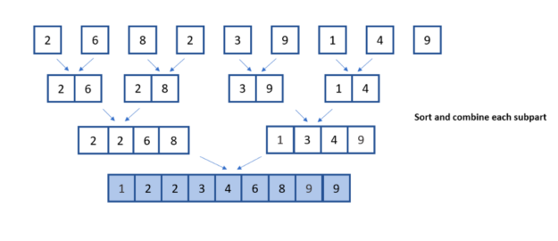

# Merge Sort

Practicing the next sorting algorithm after bubble sort.  
It is faster than bubble sort because it uses recursion and the divide and conquer method.

### Assignment

"Build a method #merge_sort that takes in an array and returns a sorted array, using a recursive merge sort methodology."

### How It Works

##### Divide (part of divide and conquer)

1. The merge_sort method breaks the array into halves
2. The merge_sort method recursively calls itself again to break the two halves of the original array into halves. Now we should have four quarters of the array
3. The merge_sort function recursively divides until all values are in two member array pairs

##### Conquer (part of divide and conquer)

4. Now that the values are in pairs, the sort method compares the two values in each pair to each other. The lower number goes on the left and the higher on the right
5. The sort method recursively calls itself. This causes two pairs of two to compare their values to each other
6. Once those four values are sorted, they compare themselves to the other group of four
7. This continues until the whole array is sorted

